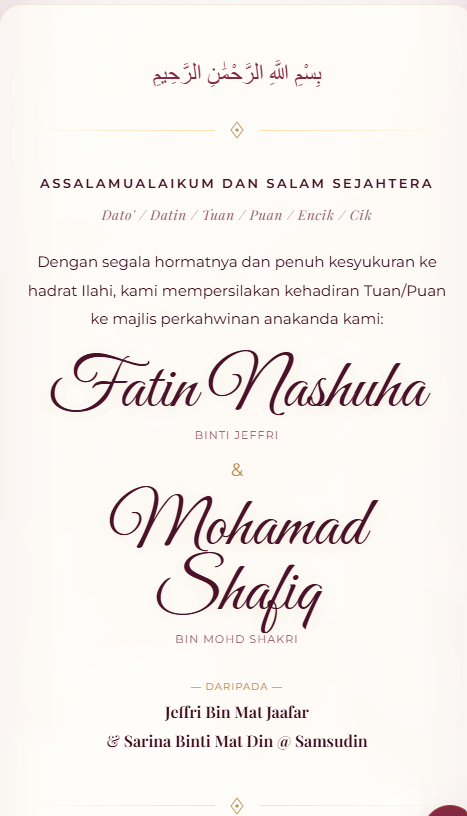
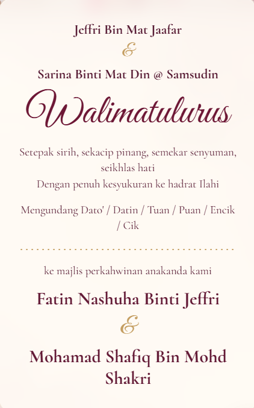

# Shua Card Visual Design Prompt

Design a premium, mobile-first Malay digital wedding invitation for **Fatin Nashuha Binti Jeffri** and **Mohamad Shafiq Bin Mohd Shakri**, dated **22 Ogos 2026**. The experience should feel romantic, refined, editorial, and personal rather than like a generic event website.

Use these supplied visual references:

## Overall Art Direction

- Mobile-first portrait invitation, designed primarily around a 390x844 viewport and centered inside a restrained phone-width frame on desktop.
- Palette: warm cream and soft blush paper, deep burgundy and wine text, muted antique gold accents, and small areas of dark maroon for depth.
- Typography: expressive wedding script for `Walimatulurus` and the couple names, elegant high-contrast serif for formal copy, and a clean uppercase sans serif for labels and controls.
- Keep body text comfortably readable. Long names should wrap in balanced lines, never shrink into tiny text.
- Use generous vertical rhythm and centered alignment. The invitation should feel composed on paper, not assembled from many floating cards.
- Use the supplied bitmap backgrounds as the visual foundation. Keep overlays subtle and avoid decorative gradient blobs, stock photography, or unrelated illustration.

## Opening Experience

Create a full-screen ceremonial opening gate using the existing burgundy wedding background. Center the supplied Nashuha/Shafiq wax emblem at a confident, tactile size. The emblem itself is the interactive object.

Place the exact hint **“Click to open the card”** below it in small, widely spaced type. On activation, the two gate halves part horizontally and reveal the invitation beneath. The transition should feel polished and calm, with a reduced-motion alternative. The emblem needs a visible keyboard focus state without adding a separate rectangular open button.

## Walimatulurus Invitation Page

Replace the current invitation composition with the quieter, airier structure shown in the target Walimatulurus reference.

The page should read from top to bottom as:

- `Jeffri Bin Mat Jaafar`
- a small gold ampersand
- `Sarina Binti Mat Din @ Samsudin`
- a large burgundy script `Walimatulurus`
- `Setepak sirih, sekacip pinang, semekar senyuman, seikhlas hati`
- `Dengan penuh kesyukuran ke hadrat Ilahi`
- `Mengundang Dato' / Datin / Tuan / Puan / Encik / Cik`
- a fine gold dotted divider
- `ke majlis perkahwinan anakanda kami`
- `Fatin Nashuha Binti Jeffri`
- a gold ampersand
- `Mohamad Shafiq Bin Mohd Shakri`

Use cream negative space, burgundy type, restrained gold ornaments, and no glass panel around this copy. The script heading should be the visual anchor, while the parent and couple names remain clear and formal.

## Event Sections

Preserve the existing date, time, venue, calendar, directions, countdown, programme, doa, RSVP wishes, fixed dock, and circular music control. Refine them to belong to the same cream, burgundy, blush, and antique-gold system.

These operational sections may use lightly framed surfaces where needed, but avoid cards inside cards. Controls should have clear spacing, readable labels, familiar icons, and enough bottom clearance for the fixed dock.

## Horizontal Gallery

Present the four local wedding-card images as an elegant horizontal 3D deck:

- The active portrait image is centered and fully opaque.
- The previous and next images peek from the left and right, slightly smaller, dimmer, and rotated inward.
- Additional images recede further behind the active card.
- Horizontal swiping changes the active image with a spring-like movement.
- Include restrained previous/next icon buttons, navigation dots, and a small current/total counter.

Keep the composition compact enough for a phone screen. Side cards may peek within the gallery stage, but nothing may create horizontal page scrolling. The user must still be able to swipe vertically through the invitation while touching the gallery.

## Closing Page

Use the supplied floral closing background and match the target reference with generous white space.

Center:

- Uppercase eyebrow: `KEHADIRAN ANDA AMAT BERMAKNA`
- Large serif heading: `RSVP & Gift`
- Copy: `Sahkan kehadiran dan tinggalkan ucapan. Ucapan terbaru akan dipaparkan di kad ini dan disimpan ke Excel.`
- Two equal burgundy pill buttons labeled `RSVP` and `GIFT`, each with a fine line icon.

Avoid placing this content inside a translucent floating card. Let the floral paper background and typography carry the composition. Keep the buttons above the fixed dock and ensure their text and icons remain comfortably centered on narrow screens.

## Interaction And Finish

- Preserve the separate music button and five-item bottom invitation dock.
- Use gentle entrance and scroll animations, never constant distracting motion.
- Provide reduced-motion behavior, visible focus, sufficient contrast, useful image descriptions, and complete keyboard access.
- Verify the opening, long names, gallery, closing buttons, sheets, dock, and music control never overlap at mobile or desktop widths.
- The final result should feel like one continuous luxury wedding invitation, not a collection of unrelated UI panels.
